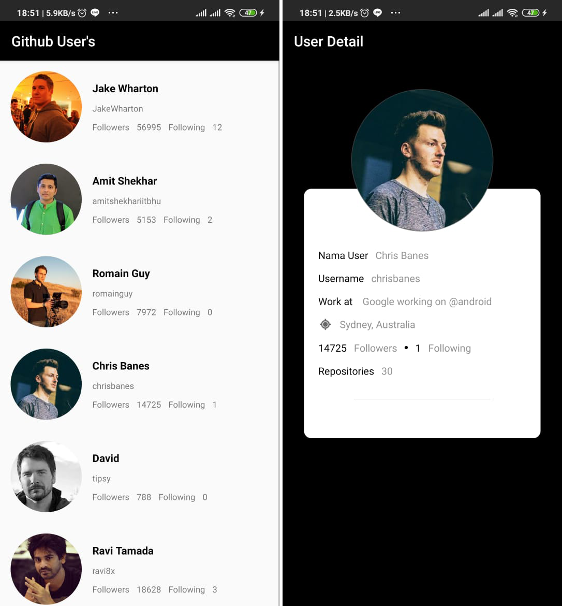

# SosDev / Sosial Developer

## Description

Aplikasi ini merupakan aplikasi untuk memenuhi syarat kelulusan program BFAA untuk submission #1 yang mempelajari tentang dasar dasar membuat tampilan di aplikasi android, intent, recyclerView atau listView, dan parcelable.

## Part of it
1. [Sosial Dev App Part 1](https://github.com/lovanto/sosDev-prototype)
2. [Sosial Dev App Part 2](https://github.com/lovanto/sosDev2-prototype)
3. [Sosial Dev App Part 3](https://github.com/lovanto/sosDev3-prototype)

## Fitures

 1. Custom RecyclerView.
 2. Parcelable Data.
 3. Intent Parcerable with Data.
 4. Page Home and User Detail.

## How To Run Using Desktop
 1. Download this repo or clone this repo using `git clone https://github.com/lovanto/sosDev-prototype.git`
 2. Open it using android studio (Prefer android studio 3 or up)
 3. Click Shift+F10

## How To Run Using Android Phone
 1. Download the SosDev.apk
 2. Install it
 3. Run it

## Notes
Use this program as a reference not for plagiarism.
